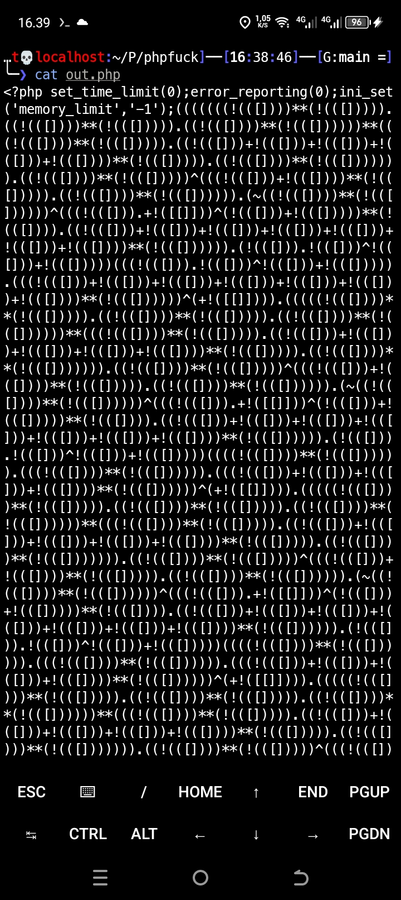

# PHP 8+ OBFUSCATOR 

Obfuscate your PHP code into unreadable format and hard to reverse engineer. Inspired by phpfuck but updated to version 8+

1. First, install composer by running `apt install composer`, then install dependencies by running `composer install` in `phpfuck` directory.
2. Run code with `php bin/phpfuck.php <yourscript.php> <output.php>`.

# Before Obfuscated
`<?php echo 'Hello World';`
# After Obfuscated

